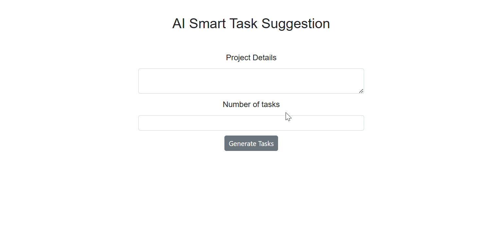

# Syncfusion-Blazor-Kanban-with-AI

This repo demonstrate the sample for AI Integration with Syncfusion Blazor Kanban Component using Microsoft's AI Extension libraries.

---

# How to Run the Project

This project demonstrates the integration of **Microsoft.Extensions.AI** with **Syncfusion Blazor Kanban component**. By integrating AI, tasks can be automatically generated based on user input, displayed on a Kanban board, and managed with smart suggestions that adapt to the project's needs. This integration streamlines task management, making it more efficient, intuitive, and responsive to changes in real-time.



---

## Steps to Run the Project

### 1. Clone the Repository
Clone the repository to your local machine:
```bash
git clone <repository-url>
cd <repository-folder>
```

---

### 2. Install Required Dependencies
Make sure all required NuGet packages are installed. Use the following commands if necessary:
```bash
dotnet restore
```

---

### 3. Configure the API Key
To enable AI-powered task generation, you need to configure your API key for the selected AI service (Azure OpenAI, OpenAI, or Ollama). Follow these steps:

#### For Azure OpenAI:
1. Open the `Home.razor.cs` file in the project.
2. Replace the placeholders in the `AzureOpenAIClient` setup with your actual **Endpoint** and **API Key**:
   ```csharp
   IChatClient client = new AzureOpenAIClient(
       new Uri("Your Endpoint"),
       new System.ClientModel.ApiKeyCredential("Your API Key")
   ).AsChatClient(modelId: "Your Deployment Name");
   ```

#### For OpenAI:
1. Open the `Home.razor.cs` file.
2. Update the `OpenAIClient` initialization with your **API Key**:
   ```csharp
   IChatClient client = new OpenAIClient("Your API Key")
       .AsChatClient(modelId: "Your Model Name");
   ```

#### For Ollama:
1. Open the `Home.razor.cs` file.
2. Configure the `OllamaChatClient` with your **Endpoint** and **Model Name**:
   ```csharp
   IChatClient client = new OllamaChatClient(
       new Uri("Your Endpoint"), 
       "Your Model Name"
   );
   ```

---

### 4. Build and Run the Project
Run the following command to build and start the application:
```bash
dotnet run
```

---

### 5. Access the Application
Once the application starts, open your browser and navigate to the provided URL. You can now interact with the AI-powered task management system.


